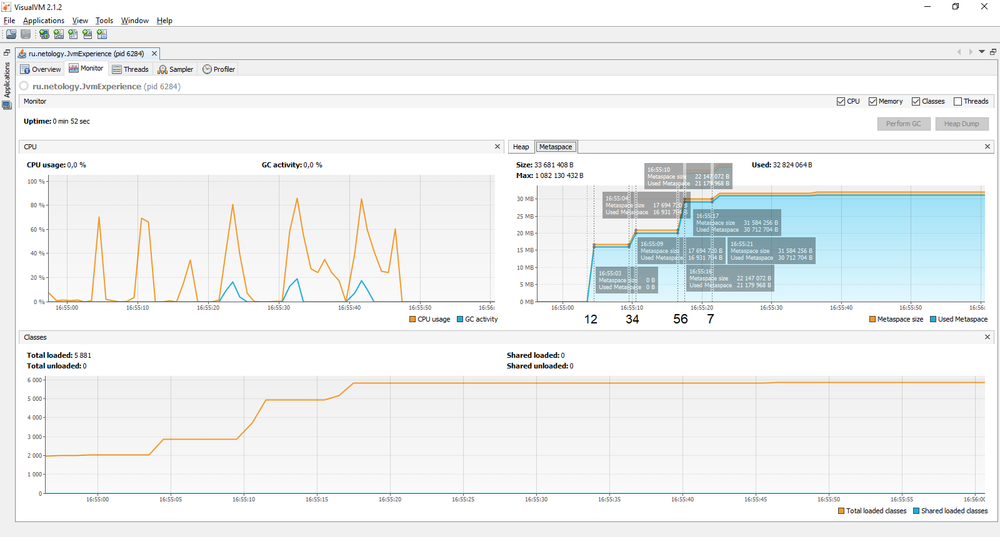
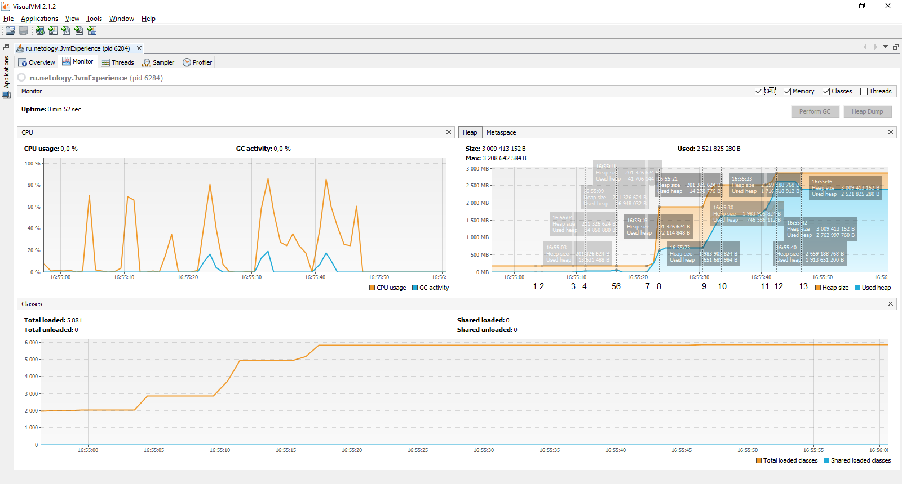

# Исследование JVM через VisualVM

Результаты работы программы представлены на графиках _(рис. 1 и 2)_ и сведены в таблицу:

|   № |   Время    | Описание                    |
|----:|:----------:|:----------------------------|
|  1. | 16:55:03.6 | loading io.vertx            |
|  2. | 16:55:04.4 | loaded 529 classes          |
|  3. | 16:55:09.4 | loading io.netty            |
|  4. | 16:55:11.3 | loaded 211 classes          |
|  5. | 16:55:16.3 | loading org.springframework |
|  6. | 16:55:16.9 | loaded 869 classes          |
|  7. | 16:55:21.9 | creating 20 000 000 objects |
|  8. | 16:55:23.8 | created                     |
|  9. | 16:55:30.8 | creating 20 000 000 objects |
| 10. | 16:55:32.7 | created                     |
| 11. | 16:55:40.1 | creating 20 000 000 objects |
| 12. | 16:55:42.3 | created                     |

Каждое действие программы пронумеровано с 1 по 12 и отображено соответствующими числами по оси _OX_ на каждом из
графиков. На _графике 1_ отображены четыре "всплеска": 1-2, 3-4, 5-6 и 7-, первые три из которых соответствуют загрузке
в область Metaspace классов из пакетов _io.vertx_, _io.netty_ и _org.springframework_ соответственно, а 4-ый всплеск
обусловлен загрузкой класса _SimpleObject_ в 16:55:21, что подтверждается результатом запуска JVM с параметром
*-verbose:class* и графиком Classes _на рисунке 1_: общее количество загруженных классов увеличилось с 5878 до 5879.

_Рис. 1. График зависимости объема памяти Metaspace от времени работы приложения_

На _графике 2_ можно увидеть три "всплеска": 7-8, 9-10 и 11-12, которые соответствуют увеличению объема занимаемой
памяти в куче при создании объектов типа _SimpleObject_. В момент создания первых 10 миллионов объектов виртуальная
машина резко увеличивает количество зарезервированной памяти для последующих объектов. Точка 13 показывает результат
работы вызова сборщика мусора. Пространство кучи существует пока работает приложение.

_Рис. 2. График зависимости объема памяти Heap от времени работы приложения_

